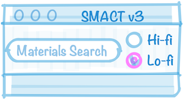

SMACT
=====

**Semiconducting Materials from Analogy and Chemical Theory** (SMACT) is a collection of fast screening tools from elemental data.

*If you torture the data enough, nature will always confess* - Roland Coase (from 'How should economists choose?')

Contents
--------

* **smact** library containing:
  * **core.py** 
  * **data.py** A collection of functions providing elemental properties.
  * **lattice.py** Given the sites, multiplicities and possible oxidation states
	at those sites, this reads from the database and generates all possible
	stoichiometeries.
  * **builder.py** Builds some common lattice structures, given the chemical
	composition.
  * **distorter.py** A collection of functions for enumerating and then
	substituting on inequivalent sites of a sub-lattice.

Requirements
------------

The main language is Python 2.7 with Numpy, Scipy and Matplotlib.
The [Atomic Simulation Environment](https://wiki.fysik.dtu.dk/ase) 
(ASE) is required for some components, as is [spglib](http://atztogo.github.io/spglib).

The [chemlab](http://chemlab.github.com/chemlab) project is not
currently used, but is considered "friendly"; we will try to avoid
namespace clashes and it may be used for some features in the future.
Needed modifications will be made in [ajjackson's
fork](https://github.com/ajjackson/chemlab), 
but are expected to make it upstream fairly rapidly.

Installation
------------

On a unix-like system, simply add the directory containing this README file
to your PYTHONPATH. e.g. in ~/.bashrc

    export PYTHONPATH="/home/username/src/smact:$PYTHONPATH"

Usage
-----

SMACT's features are
accessed through Python scripts, importing classes and functions as needed.
It is intended that SMACT will have a user-friendly interface eventually, and
possibly even a GUI. 

In addition to the `examples` folder, some practical applications using are also available from [https://github.com/WMD-group/SMACT_practical](https://github.com/WMD-group/SMACT_practical).

License and attribution
-----------------------

SMACT is produced by the Walsh Materials Design group 
at the University of Bath, UK.  Python code
and original data tables are licensed under the GNU General Public
License (GPL) v3.

The following files have their own licenses: **data/elements.txt** is
from the OpenBabel project and licensed under the GPL v2, which is
included in the parent folder.

References
----------

[K. T. Butler, J. M. Frost, J. M. Skelton, K. L. Svane and A. Walsh, 
"Computational materials design of crystalline solids", *Chemical Society Reviews* (2016)](http://pubs.rsc.org/en/content/articlelanding/2016/cs/c5cs00841g)

[B. R. Pamplin, "A systematic method of deriving new semiconducting
compounds by structural analogy", *J. Phys. Chem. Solids*
**25**, 675 (1964)](http://www.sciencedirect.com/science/article/pii/0022369764901763)

[S. Chen, X. G. Gong, A. Walsh and S.-H. Wei, "Electronic structure and stability
of quaternary chalcogenide semiconductors derived from cation cross-substitution
of II-VI and I-III-VI2 compounds", *Physical Review B* **79**, 165211 (2009)](http://journals.aps.org/prb/abstract/10.1103/PhysRevB.79.165211)

[Mendeley "Materials Design" Reading List](https://www.mendeley.com/groups/8113991/materials-design/overview/)

Development notes
-----------------

Code style should comply with [PEP
8](http://www.python.org/dev/peps/pep-0008) where possible.
[Google's house
style](http://google-styleguide.googlecode.com/svn/trunk/pyguide.html)
is also helpful, including a good model for docstrings.
Please use comments liberally when adding nontrivial features, and
take the chance to clean up other people's code while looking at it.
 
Although the project is based in Python 2.7.x, please use new-style classes and
string formatting; as well as enjoying their elegance and power, this will make
it much easier to port to Python 3 if this is ever desired.

Testing modules should be pass/fail and wrapped into **tests/test.py**.
Tests need to be run from the main directory (i.e. with `python tests/test.py`).
